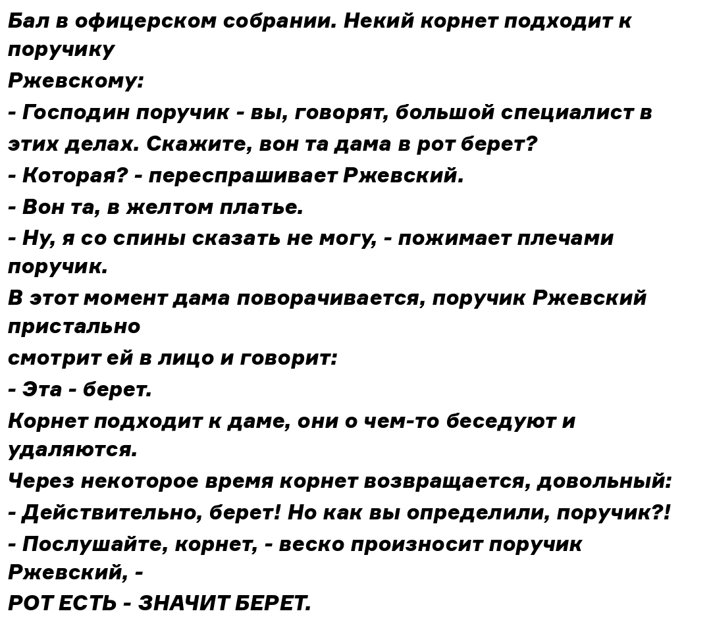

# SimpleDemotivators_2_0
Переписал библиотеку https://github.com/Infqq/simpledemotivators/tree/main под асинхрон и улучшил качество цитат!

А еще добавил функцию анекдотов(просто текст в картинку вставляет потом можно в клипы заливать) 

Примеры использования есть в файлах test.py (синхрон и test_async.py (асинхрон)

# Анекдот

# Цитата

# Демотиватор

